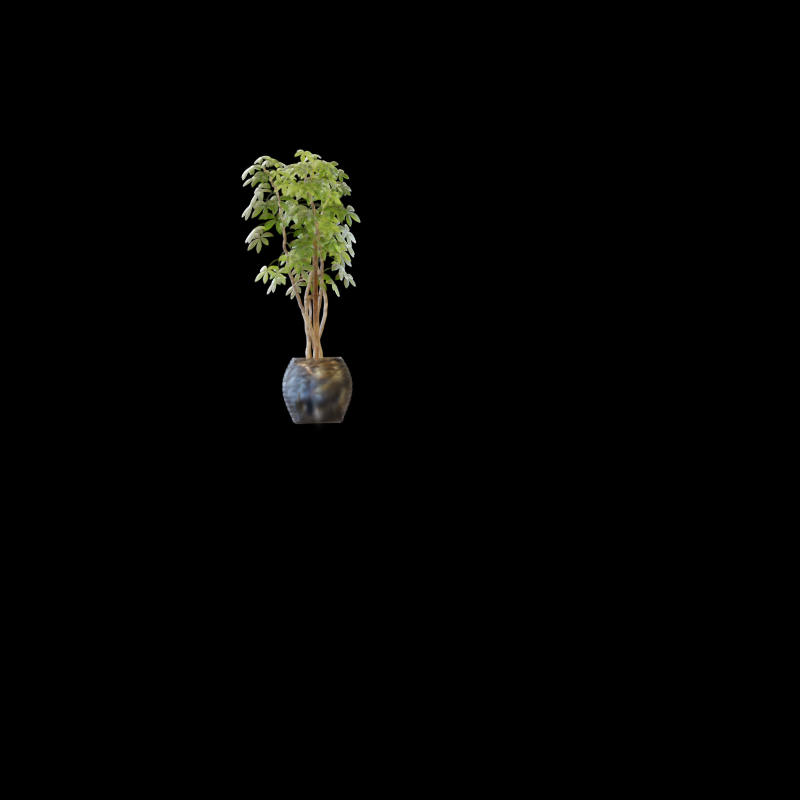
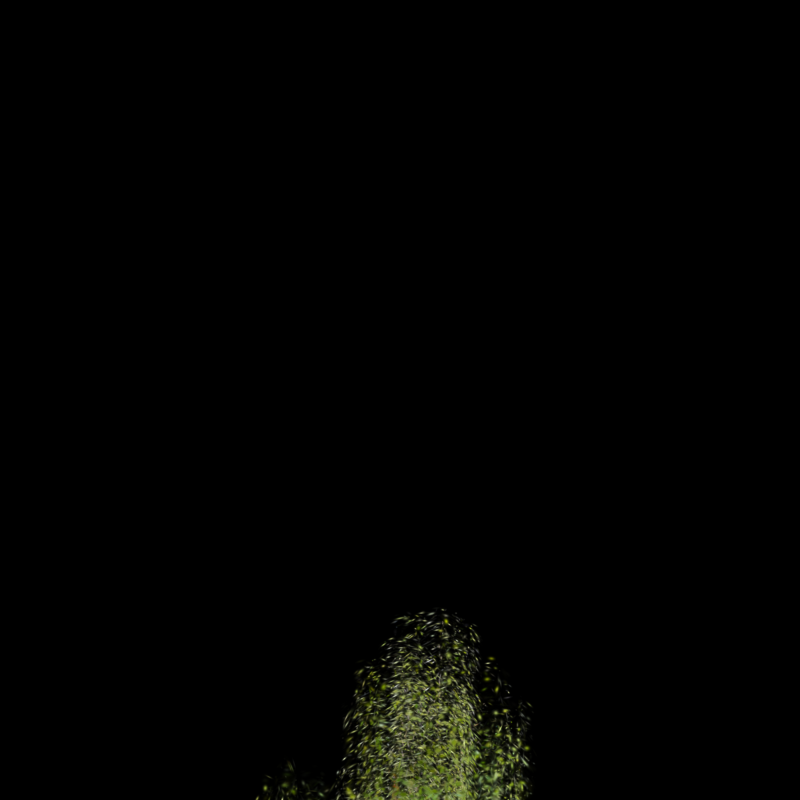
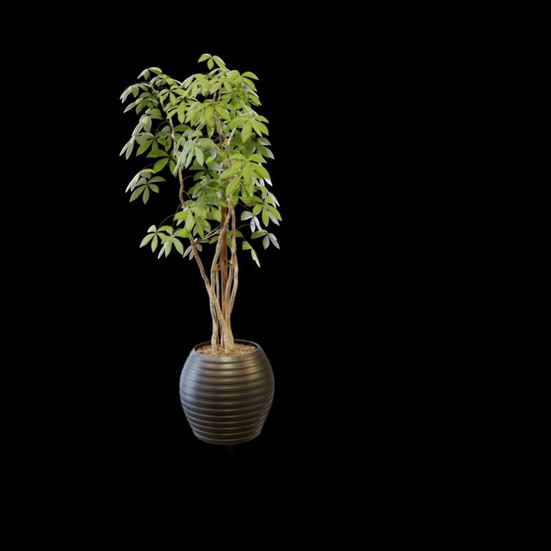
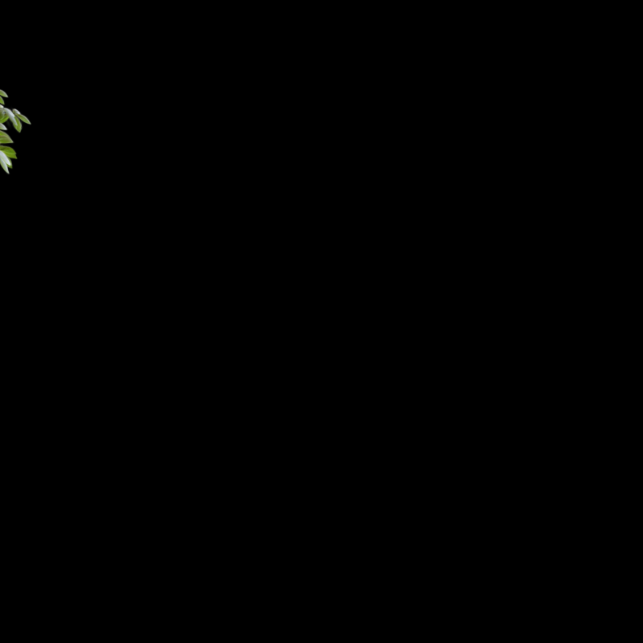
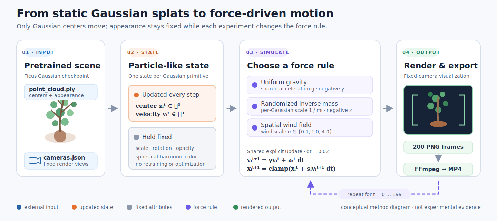

# Dream Worlds: Physics Simulation on Gaussian Splats

<p align="center">
  A notebook-first technical exploration of simple force-driven motion on a pretrained 3D Gaussian Splatting scene.
</p>

<p align="center">
  <a href="https://cgai-gatech.vercel.app/"></a>
  <a href="notebooks/gaussian_splatting_physics.ipynb"></a>
  <a href="https://www.python.org/"></a>
  <a href="https://github.com/ethanvillalovoz/dream-worlds-gaussian-physics/actions/workflows/repository-checks.yml"></a>
  
</p>

<p align="center">
  <strong>Michael Walker · Ethan Villalovoz</strong><br>
  Georgia Institute of Technology · CS 8803 CGAI · Spring 2026
</p>

<p align="center">
  <a href="paper/dream-worlds-technical-report.pdf"><strong>Technical report</strong></a> ·
  <a href="notebooks/gaussian_splatting_physics.ipynb"><strong>Notebook</strong></a> ·
  <a href="assets/demos/experimental-results.mp4"><strong>Combined demo</strong></a> ·
  <a href="https://www.youtube.com/watch?v=utVmJemMDik"><strong>YouTube</strong></a> ·
  <a href="https://cgai-gatech.vercel.app/assignment/Final_doc"><strong>Assignment</strong></a>
</p>

## Results at a glance

| Uniform gravity | Randomized inverse mass | Low wind | Medium wind | High wind |
|:---:|:---:|:---:|:---:|:---:|
|  |  |  |  |  |

Direct center updates create visible motion without retraining the Gaussian representation. Coherent motion preserves the Ficus best; stronger or more heterogeneous forces increase smearing, drift, and loss of recognizable structure. See the [full qualitative result strips](docs/RESULTS.md) or watch the [five-way comparison](assets/demos/experimental-results.mp4).

## Research question

> How can pretrained Gaussian splat representations be updated with simple physical motion while maintaining visual coherence in the rendered object?

## Method overview

<p align="center">
  
</p>

<p align="center">
  <sub>Conceptual overview derived from the notebook and technical report; not experimental evidence.</sub>
</p>

The project treats each Gaussian center as a particle-like position while keeping scale, rotation, opacity, and color fixed. For timestep $\Delta t$, the shared update is:

$$
v_i^{t+1} = \gamma v_i^t + a_i^t \Delta t,
\qquad
x_i^{t+1} = x_i^t + s_i v_i^{t+1} \Delta t.
$$

All experiments run for 200 simulation steps with $\Delta t = 0.02$, render from a fixed camera, and clamp positions to bounded scene coordinates.

## Experiments

| Experiment | Update | Camera | Bounds | Qualitative outcome |
|---|---|---:|---:|---|
| Uniform gravity | Shared acceleration along negative $y$ | 0 | $[-5, 5]$ | Coherent backward drift; recognizable through most of the sequence |
| Randomized inverse mass | Negative-$z$ gravity scaled per Gaussian | 2 | $[-10, 10]$ | Strong downward smear; structure breaks down quickly |
| Low wind | Wind field scaled by $0.1$ with damping | 0 | $[-8, 8]$ | Best balance of visible motion and shape preservation |
| Medium wind | Spatially varying wind with $\gamma = 0.98$ | 0 | $[-8, 8]$ | Clear leftward drift with moderate coherence |
| High wind | Wind field scaled by $4.0$ with damping | 0 | $[-8, 8]$ | Rapid leftward motion and early off-screen drift |

The legacy filename `wall_smash.mp4` corresponds to the uniform-gravity experiment. Filenames are preserved so the notebook and archived outputs remain compatible.

## Repository contents

```text
.
├── .github/workflows/          # Lightweight repository validation
├── assets/
│   ├── diagrams/                # Editable conceptual method overview
│   ├── demos/                  # Five experiment videos + combined comparison
│   └── previews/               # Curated report-aligned result frames
├── docs/
│   ├── REPRODUCIBILITY.md      # Environment, data, and verification notes
│   └── RESULTS.md              # Qualitative findings and frame sequences
├── figures/
│   └── method-overview/        # Figure contract and provenance manifest
├── notebooks/
│   └── gaussian_splatting_physics.ipynb
├── paper/
│   └── dream-worlds-technical-report.pdf
├── scripts/
│   └── validate_repository.py
├── AUTHORS.md
├── CITATION.cff
├── THIRD_PARTY_NOTICES.md
├── environment.yml
└── requirements.txt
```

Generated frame sequences and pretrained scene inputs are intentionally excluded from version control. The repository retains the final MP4 demos and a curated set of frames used to communicate the original results.

## Requirements

- Linux or WSL
- NVIDIA GPU with CUDA support
- Python 3.10
- Conda
- JupyterLab and FFmpeg (installed by the Conda environment)

The original setup targeted CUDA 12.8. CPU-only execution and macOS are not supported by the CUDA rasterizer used by the packaged Gaussian Splatting dependency.

## Quick start

### 1. Create the environment

```bash
git clone https://github.com/ethanvillalovoz/dream-worlds-gaussian-physics.git
cd dream-worlds-gaussian-physics

conda env create --file environment.yml -y
conda activate gaussian_splatting
```

### 2. Install PyTorch and the renderer

```bash
pip install --upgrade wheel setuptools
pip install torch torchvision torchaudio --index-url https://download.pytorch.org/whl/cu128
pip install --requirement requirements.txt --no-build-isolation
```

The Gaussian Splatting package is pinned in `requirements.txt` to the upstream revision available when the course project was completed. On RTX 50-series GPUs, set `TORCH_CUDA_ARCH_LIST="12.0"` before building the CUDA extension. Leave it unset for other architectures.

### 3. Download the pretrained Ficus scene

The notebook expects `cameras.json` and the Gaussian point cloud under `output/ficus_whitebg-trained/`. The data is not redistributed in this repository. The Conda environment includes `gdown` for this download step.

```bash
mkdir -p output
gdown --folder "https://drive.google.com/drive/folders/1Bl51dHBoTt08T3RBtslM93UIIk9C_gSB?usp=sharing" -O output
unzip output/ficus_whitebg-trained.zip -d output
```

Verify these paths before opening the notebook:

```text
output/ficus_whitebg-trained/cameras.json
output/ficus_whitebg-trained/point_cloud/iteration_30000/point_cloud.ply
```

### 4. Run the notebook

Start JupyterLab from the repository root:

```bash
jupyter lab
```

Open `notebooks/gaussian_splatting_physics.ipynb`, select the `gaussian_splatting` kernel, and run the cells from top to bottom. Frames are written to:

```text
assets/images/ficus_whitebg-trained/images/<experiment_name>/
```

The export cells write the five experiment videos to `assets/demos/`. Existing files are overwritten by FFmpeg.

For a fuller environment and output checklist, see [Reproducibility](docs/REPRODUCIBILITY.md).

## Scope and limitations

This is a course research prototype, not a general-purpose physics simulator.

- Only Gaussian centers are updated; other Gaussian attributes remain fixed.
- Motion is evaluated qualitatively from rendered frames and videos.
- The experiments use one pretrained Ficus scene and fixed cameras.
- The inverse-mass experiment is stochastic because it does not set a random seed.
- Position clamping prevents unbounded drift but is not a physical collision model.
- Full execution requires the external checkpoint and an NVIDIA CUDA environment, so CI validates repository integrity rather than rendering experiments.

## Authors and contributions

The original project was developed jointly by **Michael Walker** and **Ethan Villalovoz**. Michael led the pretrained rendering setup, packaged Gaussian Splatting integration, experimental framework, first two baselines, and comparison video. Ethan led the wind-field experiments, wind-strength ablation, repository organization and documentation, representative frame extraction, and final report writing.

See [AUTHORS.md](AUTHORS.md) for the complete project and maintenance attribution.

## Citation

Citation metadata is available in [`CITATION.cff`](CITATION.cff). GitHub can generate BibTeX and other formats from the repository's **Cite this repository** menu.

## License and provenance

No project-level software license has been declared for the original jointly authored repository. Third-party code, data, paper figures, and templates retain their own terms. In particular, the Gaussian Splatting implementation is provided for non-commercial research and evaluation under its upstream license.

See [THIRD_PARTY_NOTICES.md](THIRD_PARTY_NOTICES.md) before reusing code, data, figures, or media from this repository.

## References

- [3D Gaussian Splatting for Real-Time Radiance Field Rendering](https://repo-sam.inria.fr/fungraph/3d-gaussian-splatting/)
- [Packaged Python version used by this project](https://github.com/yindaheng98/gaussian-splatting)
- [PhysGaussian](https://openaccess.thecvf.com/content/CVPR2024/html/Xie_PhysGaussian_Physics-Integrated_3D_Gaussians_for_Generative_Dynamics_CVPR_2024_paper.html)
- [GASP](https://arxiv.org/abs/2409.05819)
- [CGAI final-project assignment](https://cgai-gatech.vercel.app/assignment/Final_doc)
